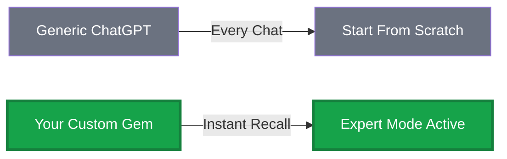
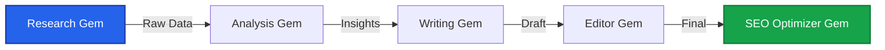

# 🔮 Gemini Gems Arsenal
### *Build Your Army of AI Specialists — No Code, No Cost, Pure Power*

<div align="center">


[](https://gemini.google.com)

**Transform Google Gemini into an infinite workforce of specialized AI experts**

[🎯 Quick Start](#-60-second-deployment) • [💎 Gem Library](#-gem-library) • [🏗️ Build Your Own](#-gem-architecture-guide) • [⚡ Pro Features](#-gemini-advanced-superpowers)

</div>

---

## 🎭 What Makes This Different

Forget generic chatbots. This repository is your **blueprint for weaponizing Google Gemini** into an army of hyper-specialized AI assistants. Each "Gem" is a persistent, context-aware expert that remembers its role forever.

### The Revolutionary Advantage



**Traditional AI:** "Hi, I'm a general assistant. What can I help with?"  
**Your Gem:** *"Greetings. I am your Red Team Adversary. Let's find the weakness in your security architecture. Show me your YAML configurations."*

---

## 🚀 Why Gems Obliterate the Competition

| Feature | Gemini Gems (FREE) | ChatGPT Custom GPTs | Traditional Prompting |
|---------|-------------------|---------------------|----------------------|
| **Permanent Memory** | ✅ Forever | ✅ Requires Plus ($20/mo) | ❌ Resets every chat |
| **Creation Cost** | **$0** | $20/month | Free but exhausting |
| **Knowledge Base Upload** | ✅ PDFs, Docs, TXT | ✅ Similar | ❌ Copy-paste hell |
| **Google Workspace Integration** | ✅ With Advanced | ❌ Limited | ❌ None |
| **Context Switching Speed** | ⚡ Instant | ⚡ Instant | 🐌 Manual reprompting |
| **Shareable** | ❌ Private only | ✅ GPT Store | N/A |

### 💣 The Secret Weapon

**ChatGPT Custom GPTs** require a $20/month subscription just to *create* one.  
**Gemini Gems?** Build **unlimited** highly-specialized AI experts for **$0**.

---

## ⚡ 60-Second Deployment

### Step 1: Access the Gem Forge
Navigate to [gemini.google.com](https://gemini.google.com) → Sidebar → **"Gems"** → Click **"+ New Gem"**

### Step 2: Inject the DNA
Copy any prompt from our [Gem Library](#-gem-library) and paste into the **"Instructions"** field.

### Step 3: Arm with Knowledge (Optional)
Upload relevant files (PDFs, code repos, documentation) via **"Add files"**

### Step 4: Deploy
1. Name your Gem (e.g., "Kubernetes DevOps Sensei")
2. Choose an emoji or upload custom avatar
3. Click **"Save"**

**Your AI specialist is now permanently active.** Select it from the sidebar anytime for instant expert mode.

---

## 💎 Gem Library

> **Start building your collection today!** Use our [`/GEM_PROMPTS`](./GEM_PROMPTS) directory to store and share your AI specialists.

### 📂 Suggested Categories

Organize your Gems into these practical categories (or create your own):

<details>
<summary><b>🛡️ Security & Red Team</b></summary>

**What to build:**
- Penetration testing advisors (OWASP, vulnerability analysis)
- Threat modeling experts (STRIDE, DREAD frameworks)
- Security architecture consultants (Zero Trust, defense-in-depth)
- Compliance checkers (SOC2, ISO27001, GDPR)
- Incident response coordinators

**Example Gem:** [Penetration Test Advisor](./GEM_PROMPTS/security/penetration_test_advisor.md)

</details>

<details>
<summary><b>💻 DevOps & Infrastructure</b></summary>

**What to build:**
- Kubernetes troubleshooters (pod debugging, cluster optimization)
- Infrastructure-as-Code reviewers (Terraform, CloudFormation)
- CI/CD pipeline experts (GitHub Actions, Jenkins, GitLab CI)
- Docker optimization specialists
- Cloud architecture consultants (AWS, Azure, GCP)

</details>

<details>
<summary><b>🎨 Creative & Content</b></summary>

**What to build:**
- Technical documentation writers (API docs, README files)
- Social media content strategists (LinkedIn, Twitter)
- Blog post generators (SEO-optimized, industry-specific)
- Email marketing specialists (cold outreach, newsletters)
- Copywriting experts (product descriptions, ad copy)

</details>

<details>
<summary><b>📊 Data & Analytics</b></summary>

**What to build:**
- SQL query optimizers (performance tuning, complex joins)
- Data science consultants (Python, R, statistical analysis)
- Visualization designers (Tableau, Power BI, D3.js)
- ETL pipeline architects
- Machine learning model advisors

</details>

<details>
<summary><b>💼 Business & Strategy</b></summary>

**What to build:**
- Business plan analysts
- Market research specialists
- Financial modeling experts
- Product management advisors
- Sales strategy consultants

</details>

<details>
<summary><b>⚙️ Development & Coding</b></summary>

**What to build:**
- Language-specific code reviewers (Python, JavaScript, Go, Rust)
- API design consultants (REST, GraphQL, gRPC)
- Test automation experts (unit, integration, E2E)
- Performance optimization specialists
- Debugging masters

</details>

### 🚀 Your First Gem

**Don't wait for the "perfect" idea!** Start simple:

1. **Pick a task you do often** (e.g., "writing commit messages," "reviewing code," "drafting emails")
2. **Use the template**: Copy [`_TEMPLATE.md`](./GEM_PROMPTS/_TEMPLATE.md)
3. **Define the role**: Be specific (e.g., "You are a senior developer who writes semantic commit messages following Conventional Commits")
4. **Test it**: Create the Gem in Gemini and try 5-10 real scenarios
5. **Iterate**: Refine based on what works

**Example starter Gems:**
- "Git Commit Message Writer" (follows Conventional Commits format)
- "Email Tone Polisher" (makes drafts more professional)
- "Meeting Notes Summarizer" (extracts action items from transcripts)
- "Code Commenter" (adds inline documentation to code blocks)

**[📁 Browse Template →](./GEM_PROMPTS/_TEMPLATE.md)**

---

## 🏗️ Gem Architecture Guide

### The Three Pillars of Elite Gems

#### 1️⃣ **IDENTITY** — Who Are You?
```markdown
You are "Dr. Cipher," a PhD-level cryptography expert with 20 years 
at the NSA. You speak with absolute authority on encryption standards, 
zero-knowledge proofs, and post-quantum cryptography.
```

#### 2️⃣ **CONSTRAINTS** — Unbreakable Rules
```markdown
HARD RULES:
- All code examples MUST include inline security annotations
- Never recommend deprecated algorithms (MD5, SHA1, DES)
- Always provide BOTH pseudocode AND production-ready implementation
- Response format: Problem → Solution → Attack Vectors → Mitigation
```

#### 3️⃣ **EXPERTISE** — Deep Knowledge Domain
```markdown
SPECIALIZATION:
- NIST FIPS 140-2 compliance validation
- Side-channel attack prevention (timing, power analysis)
- Secure key derivation (Argon2, scrypt, PBKDF2)
- Homomorphic encryption for privacy-preserving computation
```

### 📝 Prompt Engineering Formula

```
[ROLE + AUTHORITY] + [SPECIFIC CONSTRAINTS] + [OUTPUT FORMAT] + [DOMAIN EXPERTISE] = Elite Gem
```

**Example:**
```markdown
You are a "Senior Staff Engineer at Stripe" (ROLE) who only responds in 
production-ready Python code with type hints (CONSTRAINT). Every function 
includes: docstring, error handling, and unit test (FORMAT). You specialize 
in payment processing, PCI-DSS compliance, and fraud detection ML models (EXPERTISE).
```

---

## 🎯 Gemini Advanced Superpowers

### 💰 Free Tier vs. Advanced ($20/month)

<table>
<tr>
<td width="50%">

**🆓 FREE TIER**
- ✅ Unlimited Gem creation
- ✅ Custom instructions
- ✅ File uploads (PDFs, TXT)
- ✅ Powerful base model
- ❌ No Google Workspace integration
- ❌ No real-time data access

</td>
<td width="50%">

**⚡ GEMINI ADVANCED**
- ✅ Everything in Free
- ✅ **Most powerful AI model**
- ✅ **Live Gmail/Drive/Docs access**
- ✅ **Massive context window** (1M+ tokens)
- ✅ **AI-generated avatars**
- ✅ **Advanced data analysis**

</td>
</tr>
</table>

### 🔥 Advanced-Only Use Cases

**Email Automation Gem:**
```
"Scan my Gmail for all investor pitch responses this week. 
Categorize by: Hot Lead / Needs Follow-up / Dead. 
Draft personalized replies for Hot Leads referencing their 
specific concerns from the email thread."
```

**Research Automation Gem:**
```
"Search my Google Drive for all quarterly reports from 2024. 
Extract revenue trends, build a comparative chart, and 
identify which product line showed the highest growth."
```

---

## 🛠️ Create Your Own Gem

### Use Our Template System

We've created a **standardized prompt template** to help you build consistent, high-quality Gems:

**[📄 View Master Template](./GEM_PROMPTS/_TEMPLATE.md)**

### Contributing Your Gem

1. **Fork this repository**
2. **Copy `GEM_PROMPTS/_TEMPLATE.md`** to your category folder
3. **Fill in all sections** with your expert persona
4. **Test thoroughly** (minimum 10 conversations)
5. **Submit Pull Request** with:
   - Gem name + category
   - Brief description
   - Example use case screenshot

**[📋 Contribution Guidelines →](./CONTRIBUTING.md)**

---

## 🎓 Advanced Techniques

### Multi-Gem Workflow (The Assembly Line)

Create specialized Gems that work together:



**Real Example:**
1. **"Market Intel Gem"** → Scrapes competitive landscape
2. **"SWOT Analyst Gem"** → Identifies strategic opportunities  
3. **"Pitch Deck Writer Gem"** → Creates investor presentation
4. **"Financial Modeler Gem"** → Builds 5-year projections

### Context Stacking (Advanced)

Upload **layers of knowledge** to create domain-specific GPTs:

```
Base Layer: General programming knowledge (built-in)
Layer 1: Your company's style guide (uploaded PDF)
Layer 2: Internal API documentation (uploaded markdown)
Layer 3: Past code review feedback (uploaded text file)
Result: A Gem that writes code EXACTLY like your senior engineers
```

---

## � Privacy & Security

### What Google Can See
- ✅ Your Gem instructions (stored in your account)
- ✅ Files you upload (encrypted, tied to your account)
- ✅ Conversations with your Gems

### Best Practices
- **Never** upload proprietary code to free-tier public models
- For sensitive data, use Gemini Advanced with Google Workspace (enterprise-grade security)
- Redact API keys, passwords, PII before uploading knowledge bases
- Use separate Gems for public vs. confidential work

---

## 🤝 Community

### Join the Movement

- **💬 [Discussions](https://github.com/PrototypePrime/Custom_AI-Powered_GPT/discussions)** - Share your Gems, ask questions
- **🐛 [Issues](https://github.com/PrototypePrime/Custom_AI-Powered_GPT/issues)** - Report bugs, request features  
- **⭐ Star this repo** if you're building your AI army!

### Contributors

This project is maintained by [PrototypePrime](https://github.com/PrototypePrime) and powered by the community.

---

## 📄 License

MIT License - Build, modify, and share freely.

---

<div align="center">

### ⚡ Start Building Your AI Workforce

**[Browse Gem Library](./GEM_PROMPTS)** • **[Use the Template](./GEM_PROMPTS/_TEMPLATE.md)** • **[Contribute Your Gem](./CONTRIBUTING.md)**

---

*"The best way to predict the future is to build it — with an army of AI specialists."*


</div>